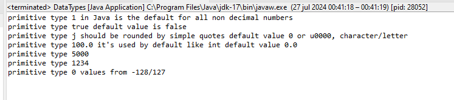
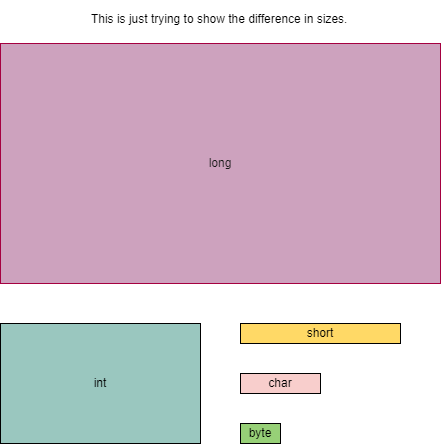
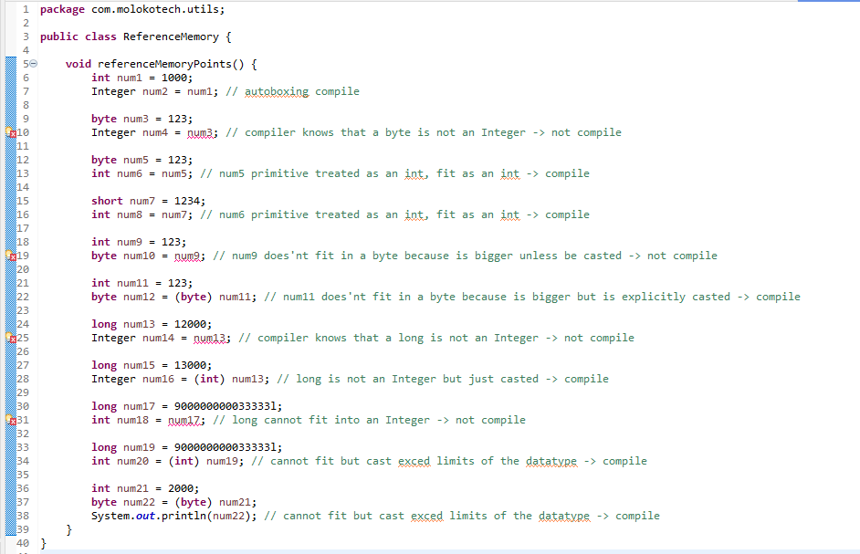
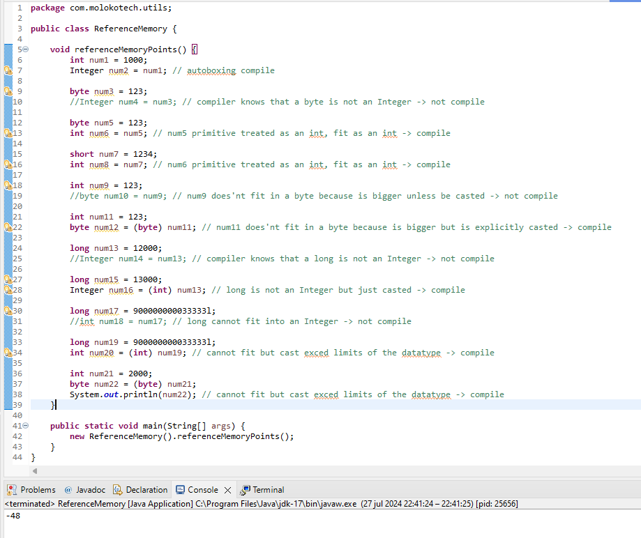

[sandbox.molokotech.com](https://docusaurus.io/docs/blog) are powered by the [Molokotech](http://web.molokotech.com/?lang=en).


Java has an strong dependency with data types, it is important to understand how they works and how to use it.

Have you ever tougth why there are so many data types from different sizes? it's really easy to explain, just because when Java was created sitting on 1995 and years later, the devices were Java could installed were pretty small in memory, so the aproach to used only data types that reserves less memory was important.

Today no one is concerned by this because your **phone** today is **faster** and **bigger** about memory speaking than your computers.

Today it's not a problem if you choose to use a **byte** or an **int** because it does'nt have side effects on the devices.

Data Types in **Java**.

```java
package com.molokotech.models;

public class DataTypes {
    private int num = 1;                // Integer wrapper Class
    private boolean isBigger = true;	// Boolean wrapper Class
    private char ch = 'j';              // Character wrapper Class
    private float f = 100;              // Float wrapper Class cast needed 100f/100F
    private long l = 5000;              // Long wrapper Class cast needed 5000l/5000L
    private short sh = 1234;            // Short wrapper Class
    private byte b = 0;	                // Byte wrapper Class
    
    // private vars can access to methods from the same class
    private void getDataType() {
        System.out.println("primitive type " + this.num + " in Java is the default for all non decimal numbers");
        System.out.println("primitive type " + this.isBigger + " default value is false");
        System.out.println("primitive type " + this.ch + " should be rounded by simple quotes default value 0 or u0000, character/letter");
        System.out.println("primitive type " + this.f + " it's used by default like int default value 0.0");
        System.out.println("primitive type " + this.l);
        System.out.println("primitive type " + this.sh);
        System.out.println("primitive type " + this.b + " values from -128/127");
    }
    
    // getDataType() should be called only from this class
    public static void main(String[] args) {
		new DataTypes().getDataType();
	}
}
```



**Wrapper** classes <font color="red">Float</font> and <font color="red">Long</font> shoud be casted when declared until it reference another variable, in this momment compile apply **autoboxing** strategy.

```java
package com.molokotech.models;

public class Cast {
	
    private float f = 100;	// Float wrapper Class cast needed 100f/100F
    private long l = 5000;	// Long wrapper Class cast needed 5000l/5000L

    private void doCast() {
    	Float sh = 123f;	// must be casted -> Float sh = 123; not compile!!
    	Float shRef = this.f;   // Autoboxing when ref another variable not casting needed
    	
    	Long l = 123l; 		// must be casted -> Long l = 123; not compile!!
    	Long lref = this.l; 	// Autoboxing when ref another variable not casting needed
    }
	
}
```
There three rules:
1) Every **number** data-types **non-decimal** is treated as an **int** always unless it is explicitly cast.
2) Every **number** data-types decimal es treated as an double always unless it is explicitly cast.
3) Cannot do reference from a smaller data-type to a bigger data-type, because it does'nt fit, unless it is casted, in that case the value will try to fit passing maximun values.

The next image it's not absolute and is just note the different sizes between data types in a graphical way.



This code has some **COMPILATION PROBLEMS** related to bigger data-types trying to fit in smaller or incompatible data-types and other valid code you should copy into your IDE and make an analize it.

```java

package com.molokotech.utils;

public class ReferenceMemory {
    
	void referenceMemoryPoints() {
    	int num1 = 1000;
    	Integer num2 = num1; // autoboxing compile
    	
    	byte num3 = 123;
    	Integer num4 = num3; // compiler knows that a byte is not an Integer -> not compile
    	
    	byte num5 = 123;
    	int num6 = num5; // num5 primitive treated as an int, fit as an int -> compile
    	
    	short num7 = 1234;
    	int num8 = num7; // num6 primitive treated as an int, fit as an int -> compile
    	
    	int num9 = 123;
    	byte num10 = num9; // num9 does'nt fit in a byte because is bigger unless be casted -> not compile
    	
    	int num11 = 123;
    	byte num12 = (byte) num11; // num11 does'nt fit in a byte because is bigger but is explicitly casted -> compile
    	
    	long num13 = 12000;
    	Integer num14 = num13; // compiler knows that a long is not an Integer -> not compile
    	
    	long num15 = 13000;
    	Integer num16 = (int) num13; // long is not an Integer but just casted -> compile
    	
    	long num17 = 900000000033333l;
    	int num18 = num17; // long cannot fit into an Integer -> not compile
    	
    	long num19 = 900000000033333l;
    	int num20 = (int) num19; // cannot fit but cast exced limits of the datatype -> compile
    	
    	int num21 = 2000;
    	byte num22 = (byte) num21;
    	System.out.println(num22); // cannot fit but cast exced limits of the datatype -> compile
    }
	
}
```

Viewing the results in the IDE



If we comment the compilation problems and run the program we see that prints a negative number even if we assign a positive number, this is because it reach out the max size of data-type and force it to assign with the cast, so it tries to fit anyway passing the limits.

