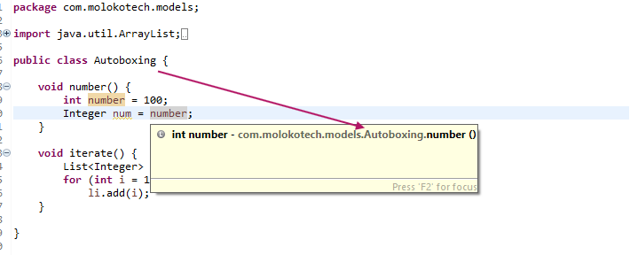
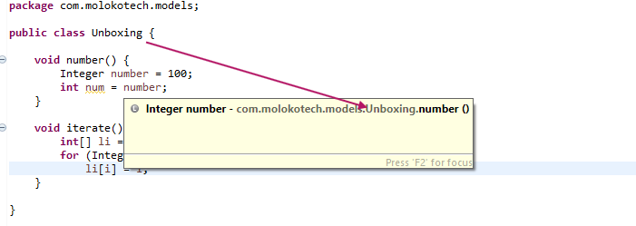

**Autoboxing** is the conversion from a **primitive** value to a **Wrapper** Classes.
It is a background operation outside from de programmer control, that transform primitive types creating objects without explicity creating in the code.

__The simplest way__:<br/>
`Integer i = 1;`

 From behind the scenes compiler run new Integer(1) although the IDE says it's deprecated when you type it, the intention is to write cleaner code.

__It runs when__:<br/>
1) Passed as a parameter to a method that expects a value of the corresponding object wrapper type.
2) Assigned to a variable of the corresponding object wrapper type.

```java
package com.molokotech.models;

public class Autoboxing {
	
	// Assigned to a variable
	void number() {
		int number = 100;
		Integer num = number;	// The compiler converts from int to new Integer
	}

	// Passed as a parameter
	void iterate() {
		List<Integer> li = new ArrayList<>();
		for (int i = 1; i < 50; i)
		    li.add(i);	// The compiler converts from int to new Integer
	}

	// Simplest examples
	void autoboxing() {
		Character c = 'c';	// char to new Character
		Integer i = 1;		// int to new Integer
	}

	/* remainder (%) and unary plus (+=) operators does'nt works with:
		Integer
		Byte
		Short
	Only primitive types are allowed for this operators so from behind the scenes always invokes i.intValue() */
	public int sum(List<Byte> li) {
		int sum = 0;
		for (Byte i : li)
			if (i % 2 == 0)
				sum += i;
			return sum;
	}

}
```



**Unboxing** is the conversion from an **Object** to a **primitive** value.

__The simplest way__:<br/>
`Integer number = 100; int num = number;`

1) Passed as a parameter to a method that expects a value of the corresponding primitive type.
2) Assigned to a variable of the corresponding primitive type.

```java
package com.molokotech.models;

public class Unboxing {
	
	// Assigned to a variable
	void number() {
		Integer number = 100;
		int num = number; 	// The compiler convertes from Integer to int
	}

	// Passed as a parameter
	void iterate() {
		int[] li = new int[50];
		for (Integer i = 1; i < 50; i += 2)
			li[i] = i;
	}

}
```



Java compiler run the background operation with for **autoboxing** and **unboxing** on the corresponding wrapper clases:

| Primitive type | Wrapper class |
|----------------|---------------|
| boolean    	 | Boolean       |
| byte    	 	 | Byte       	 |
| char    	 	 | Character     |
| float    	 	 | Float       	 |
| int    	 	 | Integer       |
| long    	 	 | Long       	 |
| short    	 	 | Short       	 |
| double    	 | Double        |

<!-- truncate -->