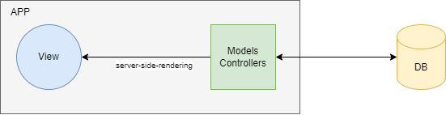
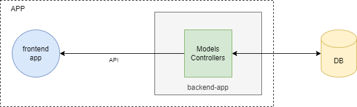
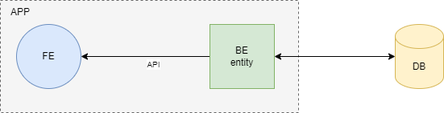
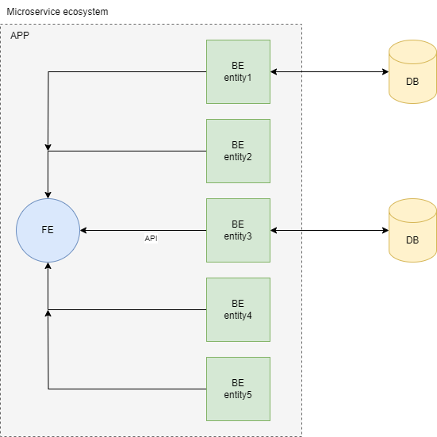
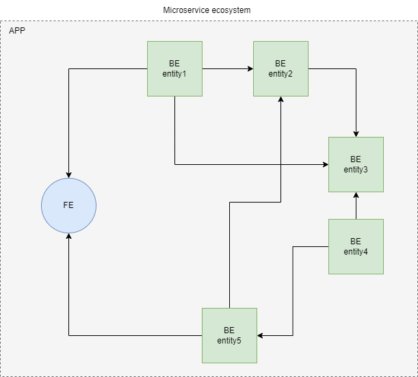
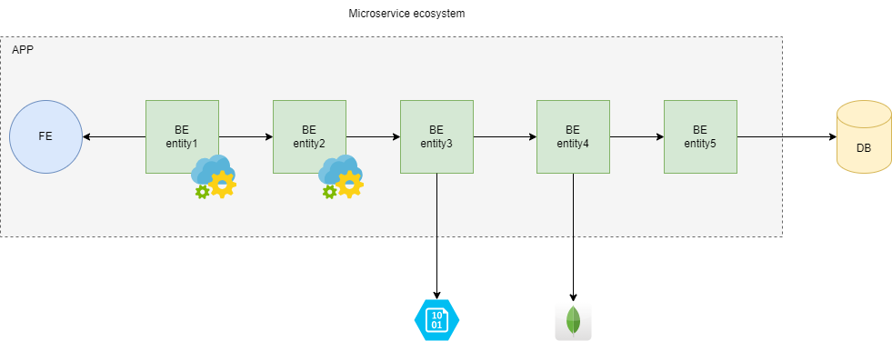

## Monolitos vs Microservicios

### Monolitos

Un monolito es una gran bloque de código que tiene un propósito de negocio que cumplir, los mismos habitualmente están conformados por una aplicación que algutina toda la lógica del negocio en el mismo lugar, en aquellas apicaciones donde exista una interfaz gráfica esmuy común que la misma esté integrada al monolito sin embargo no es excluyente y puede ocurrir que exista monolito sin ui y que la misma se conecte por REST por ejemplo u otro tipo de api.

Podemos definir a un monolito como un concepto de conjunto o aglutinación de lógica que permite concentrar código en un mismo lugar, naturalmente ante el crecimiento vertical del mismo hace poco escalable su crecimiento a través del tiempo.

##### Monolito completo

Este es el ejemplo más clásico de lo que representa un monolito, una aplicación con todo el core de negocio e interface si existiera dentro del mismo bloque de código, loque es importante entender es que los monolitos no son todos WEB, por ejemplo es común que las aplicaciones de escritorio por ejemplo con Java Swing o JavaFX sean un gran bloque de código integrado.

Ejemplos como este pueden ser los siguientes:
* Aplicaciones Java swing
* Aplicaciones JavaFX
* Aplicaciones Server side Rendering, JSP, JSF, etc, con algún template engine como Thymeleaf u otro.

##### Monolito por acoplamiento de lógica core

* Aplicaciones por ejemplo en Java, PHP o algún lenguaje de programación que tenga ligado fuertemente su core de  en un bloque de código difícil de desarmar, incluso existiendo una aplicación cliente que consuma datos por medio de alguna API no deja de ser un monolito.

_Es importante aclarar que API puede ser más de un tipo no sólo REST, puede ser GRPC, Graphql, SOAP, etc_

### Microservicios

Un microservicio conceptualmente es una aplicación que tiene una función determinada y que sirve datos a traves de alguna API del algún tipo, es un concepto de desarrollo que puede tener variantes dependiendo cómo se lo use, pero lo más importante es que cumpla con el concepto de responsabilidad única más allá del tamaño ya que un microservicio puede ser chico, mediano o grande ya que la palabra micro es sólo un concepto abstracto que atomiza responsabilidades en sistemas distribuidos.

##### Microservicio

Este ejemplo sólo muestra una aplicación que para poder llamarla microservicio debe cumplir una responsabilidad única, si la misma tiene una función particular puede llamarse microservicio, sino sólo es una aplicación que expone servicios mediante algún tipo API por ejemplo la más común REST.

##### Ecosistema de microservicios

Un ecosistema de microservicios es un conjunto de aplicaciones distribuidas con diferentes responsabilidades que funcionan en forma autónoma y que su forma de comunicación es mediante algún tipo de API, los ecosistemas de microservicios habitualmente son un proyecto a nivel empresarial para responder ante una demanda de aplicaciones que consumirán diferentes orígenes de información.

##### Monolito de microservicios distribuidos

En sus inicios los microservicios se utilizaron para tener una responsabilidad única y muy importante poder funcionar autónomamente sin tener acoplamiento con otras aplicaciones lo que le daba inependencia de funcionamiento, esto hoy en día está siendo sobreescrito en diferentes ecosistemas que se desarrollan con dependencias entre microservicios acoplando el funcionamiento de uno con la existencia de otro en comunicaciones server to server, aunque este escenario está tomando más auge y adopato su uso en gran cantidad de empresas es el más riesgoso de todos los escenarios nombrados anteriormente, ya que acopla el funcionamiento de aplicaciones con otras, lo cual necesita una orquestación particular entre células que mantengan actualizadas aplicaciones.
Un Monolito distribuido es una práctica común hoy en díaen el mundo empresarial, la cual puede de ser mejor monitoreada con aplicaciones como Istio, service Mesh u Observabilidad en trazas, sin embargo si no se toman estas medidas de monitoreo el control del mismo es caótico ya que a diferencia de los monolitos estandar acá son aplicaciones están distribuidas en diferentes orígenes pero son dependientes unas de otras.

##### Microservicios distribuidos en cadena

Existen esquemas más maduros de un monolito distribuido donde en realidad es una cadena de microservicios que ejecutan un resultado final, es en definitiva un monolito con pasos definidos y una distribución de la carga controlada, por ejemplo es conocido el esquema de microservicios en cadena que tiene Netflix, con aplicaciones distribuidas que tienen diversas funcionalidades para obtener un resultado, la comunicación entre las mismas puede ser por HTTP, por TCP u otro tipo, lo importante de definir acá es que éstas arquitecturas demandan un mantenimiento y una gestión diferente ya que la interoperabilidad entre las aplicaciones es el core de su funcionamiento.

